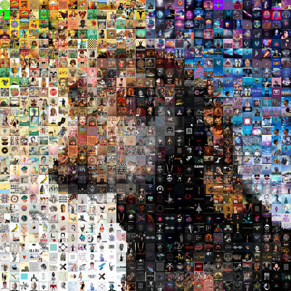
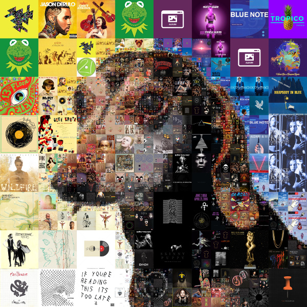

# Gosaic

[](https://travis-ci.org/atongen/gosaic)

Create your own image mosaics.

## Installation

### Binary

Download the latest [release](https://github.com/atongen/gosaic/releases), unzip and put the binary somewhere on your PATH.

### Building

#### Requirements

* golang 1.5.x or later

```shell
λ go get github.com/atongen/gosaic
```

_OR_

```shell
λ git clone git@github.com/atongen/gosaic.git
λ cd gosaic
λ make
```
The project _should_ build on Windows, but so far has only been tested on Linux and osx.

## Examples

### Add Images to the Index

```shell
λ gosaic index ~/tmp/cover_art
GOSAIC: 2016/12/14 17:53:14 Indexing 1744 images...
 1744 / 1744 [===========================================================================================] 100.00% 1m39s
```

### Create an Aspect Mosaic

[](examples/obi-aspect-mosaic.jpg)

```shell
λ gosaic mosaic aspect ~/tmp/obi.jpg --width 3600 --height 3600 -n obi-aspect
GOSAIC: 2016/12/14 18:00:27 Building 900 cover partials...
 900 / 900 [================================================================================================] 100.00% 0s
GOSAIC: 2016/12/14 18:00:30 Wrote cover image: /home/atongen/tmp/obi-aspect-cover.png
GOSAIC: 2016/12/14 18:00:31 Wrote macro image: /home/atongen/tmp/obi-aspect-macro.jpg
GOSAIC: 2016/12/14 18:00:31 Building 900 macro partials...
 900 / 900 [===============================================================================================] 100.00% 27s
GOSAIC: 2016/12/14 18:00:58 Building 1744 index image partials...
 1744 / 1744 [==============================================================================================] 100.00% 0s
GOSAIC: 2016/12/14 18:00:59 Building 1569600 partial image comparisons...
 1569600 / 1569600 [===================================================================================] 100.00% 2h8m24s
GOSAIC: 2016/12/14 20:09:24 Building 900 mosaic partials...
 900 / 900 [===============================================================================================] 100.00% 36s
GOSAIC: 2016/12/14 20:10:01 Drawing 900 mosaic partials...
 900 / 900 [===============================================================================================] 100.00% 30s
GOSAIC: 2016/12/14 20:10:32 Wrote mosaic image: /home/atongen/tmp/obi-aspect-mosaic.jpg
```

### Create a Quad Mosaic

[](examples/obi-quad-mosaic.jpg)

```shell
λ bin/gosaic mosaic quad ~/tmp/obi.jpg --width 3600 --height 3600 -n obi-quad
GOSAIC: 2016/12/14 07:06:55 Wrote macro image: /home/atongen/tmp/obi-quad-macro.jpg
GOSAIC: 2016/12/14 07:06:55 Building macro quad with 700 splits, 2104 partials, min depth 3, max depth 9, min area 1794, max area 360000
 2104 / 2104 [===========================================================================================================] 100.00% 4m34s
GOSAIC: 2016/12/14 07:11:31 Wrote cover image: /home/atongen/tmp/obi-quad-cover.png
GOSAIC: 2016/12/14 07:11:31 Building 1744 index image partials...
 1744 / 1744 [===========================================================================================================] 100.00% 4m25s
GOSAIC: 2016/12/14 07:16:00 Building 3669376 partial image comparisons...
 3669376 / 3669376 [=================================================================================================] 100.00% 10h38m33s
GOSAIC: 2016/12/14 17:54:33 Building 2104 mosaic partials...
 2104 / 2104 [===========================================================================================================] 100.00% 1m40s
GOSAIC: 2016/12/14 17:56:13 Drawing 2104 mosaic partials...
 2104 / 2104 [============================================================================================================] 100.00% 1m8s
GOSAIC: 2016/12/14 17:57:23 Wrote mosaic image: /home/atongen/tmp/obi-quad-mosaic.jpg
```

## Usage

### Overview

There are two steps to creating an image mosaic with gosaic. First, add images to
an index. These are the small images that will make up the tiles in the mosaic. Second,
build the mosaic from an image using the images added to the index.

Gosaic will populate a local sqlite3 database with metadata used to build the photo mosaic.
It will not modify any images added to the index, and it will not modify the aspect ratio
of any of the partial index images, or the large image rendered in the mosaic.

Three images will be produced: The cover image, which shows a grid where the partial index
images will be placed against the large (macro) image. The macro image, which is the large
image that the final mosiac is based on. It is cropped and resized to the exact size of the
final mosaic image. This is sometimes useful for post-processing. And the final mosaic image.
The final mosaic jpeg image is created at 300 dpi.

The best mosaics will be created from large indexes with a wide variety of high quality images.
However, large indexes will increase the amount of time required to generate a mosaic.
It's usually best to start small and do some experimentation and work your way up to a
large mosaic. Gosaic does its best to calculate sane defaults for all values, so in most
cases a basic command will result in a good mosaic.

### Index Sub-Command

Use the `index` sub-command to add images to an index. For example:

```shell
λ gosaic index path/to/image/directory
λ gosaic index path/to/file1.jpg path/to/file2.jpg
```

Or, if you have a file with a list of files and/or directories that you want to
add to the index, you can do something like:

```shell
λ gosaic index < path/to/list.txt
```

If images in your index have been modified, re-indexing the same directory or files will calculate only the changes.

If images in your index have been removed from your hard drive, then run the index command with the `--clean` flag to verify the existing index,
and remove any images from the index that are no longer found.

`index` sub-command help:

```shell
λ gosaic index -h
Manage index images

Usage:
  gosaic index [PATHS...] [flags]

Flags:
  -c, --clean   Clean the index
  -l, --list    List the index
  -r, --rm      Remove entries from the index

Global Flags:
      --dsn string    Database connection string (default "sqlite3://$HOME/.gosaic.sqlite3")
      --workers int   Number of workers to use (default 8)
```

### Aspect Mosaic Sub-Command

`mosaic aspect` sub-command help:

```
λ gosaic mosaic aspect -h
Create an aspect mosaic from image at PATH

Usage:
  gosaic mosaic aspect PATH [flags]

Flags:
  -a, --aspect string      Aspect of mosaic partials (CxR)
      --cleanup            Delete mosaic metadata after completion
      --cover-out string   File to write cover partial pattern image
  -d, --destructive        Delete mosaic metadata during creation
  -f, --fill-type string   Mosaic fill to use, either 'random' or 'best' (default "random")
      --height int         Pixel height of mosaic, 0 maintains aspect from width
      --macro-out string   File to write resized macro image
      --max-repeats int    Number of times an index image can be repeated, 0 is unlimited, -1 is the minimun number (default -1)
  -n, --name string        Name of mosaic
      --out string         File to write final mosaic image
  -s, --size int           Number of mosaic partials in smallest dimension, 0 auto-calculates
  -t, --threashold float   How similar aspect ratios must be (default -1)
  -w, --width int          Pixel width of mosaic, 0 maintains aspect from image height

Global Flags:
      --dsn string    Database connection string (default "sqlite3://$HOME/.gosaic.sqlite3")
      --workers int   Number of workers to use (default 8)
```

#### Aspect Mosaic Flags

<dl>
  <dt>--name</dt>
  <dd>Name of mosaic. If not provided, it will default to the base name of the input image. Must be unique.</dd>

  <dt>--aspect</dt>
  <dd>Aspect of mosaic partials (CxR or Columns x Rows). For example: '1x1', '2x3', '3x2'. Defaults to the same aspect ratio as the macro image.</dd>

  <dt>--width</dt>
  <dd>Pixel width of mosaic, 0 maintains aspect from input image height</dd>

  <dt>--height</dt>
  <dd>Pixel height of mosaic, 0 maintains aspect from input image width</dd>

  <dt>--fill-type</dt>
  <dd>
    Mosaic fill to use, either 'random' or 'best'. Random will randomly select the next mosaic partial to fill. Best will select the closest matching index partial when choosing which mosaic partial to fill.
    Random delivers good results with less appearance of repeats. Best is significantly slower than random.
  </dd>

  <dt>--max-repeats</dt>
  <dd>
    The number of times that an index image can be repeated. Valid values are -1, 0 or a positive integer.

    If you select 0, then there is no limit and the best matching index image will be placed in any mosaic partial no matter how many times it has already been used.

    A positive integer `N` will limit the number of times an index image can be repeated to that number.
    This will cause an error if the number of mosaic partials is larger than `N` times the number of index images.

    -1 will calculate the minimum number of valid repeats for the mosaic. If there are more index images than mosaic partials, then the number of allowed repeats will be 0.
    If there are less, then it will chose the smallest number of repeats possible.
    This defaults to -1.
  </dd>

  <dt>--size</dt>
  <dd>
    The number of mosaic partials in smallest dimension. For example, if your mosaic is 600x400, and your size is 10, you would end up with 10 mosaic partials in the vertical dimension, each 40 pixels tall.
    The number and size of the partials in the other dimension would be determined by the aspect ratio of the mosaic partials.
  </dd>

  <dt>--threashold</dt>
  <dd>
    How similar aspect ratios must be. Allows you to filter out index images whose aspect ratio varies greatly from the aspect ratio of the mosaic partial.
    Threashold must be larger than the absolute value of the difference between the index ratio and the mosaic partial ratio, or the index image is excluded from the mosaic.
    Defaults to -1, which disables the check.
  </dd>

  <dt>--cleanup</dt>
  <dd>Delete mosaic metadata after completion. Can help keep the size of the database smaller. Defaults to false.</dd>

  <dt>--destructive</dt>
  <dd>Delete mosaic metadata during creation. Defaults to false.</dd>

  <dt>--cover-out</dt>
  <dd>File to write cover partial pattern image. Defaults to the mosaic name, with `-cover.png` appended, in the same folder as the input image.</dd>

  <dt>--macro-out</dt>
  <dd>
    File to write resized macro image. Defaults to the mosaic name, with `-macro.jpg` appended, in the same folder as the input image.
    This is a copy of the input image, resized and cropped exactly to match the resulting mosaic. Can be useful for post-processing the mosaic.
  </dd>

  <dt>--out</dt>
  <dd>
    File to write final mosaic image. Defaults to the mosaic name, with `-mosaic.jpg` appended, in the same folder as the input image.
  </dd>
</dl>

### Quad Mosaic Sub-Command

`mosaic quad` sub-command help:

```
λ gosaic mosaic quad -h
Create quad-tree mosaic from image at PATH

Usage:
  gosaic mosaic quad PATH [flags]

Flags:
      --cleanup            Delete mosaic metadata after completion
      --cover-out string   File to write cover partial pattern image
  -d, --destructive        Delete mosaic metadata during creation
  -f, --fill-type string   Mosaic fill to use, either 'random' or 'best' (default "random")
      --height int         Pixel height of mosaic, 0 maintains aspect from width
      --macro-out string   File to write resized macro image
      --max-area int       The largest a partial can be (default -1)
      --max-depth int      Number of times a partial can be split into quads (default -1)
      --max-repeats int    Number of times an index image can be repeated, 0 is unlimited, -1 is the minimun number (default -1)
      --min-area int       The smallest a partial can get before it can't be split (default -1)
      --min-depth int      Minimum number of times all partials will be split into quads (default -1)
  -n, --name string        Name of mosaic
  -o, --out string         File to write final mosaic image
  -s, --size int           Number of times to split the partials into quads (default -1)
  -t, --threashold float   How similar aspect ratios must be (default -1)
  -w, --width int          Pixel width of mosaic, 0 maintains aspect from image height

Global Flags:
      --dsn string    Database connection string (default "sqlite3://$HOME/.gosaic.sqlite3")
      --workers int   Number of workers to use (default 8)
```

#### Quad Mosaic Flags


<dl>
  <dt>--name</dt>
  <dd>Name of mosaic. If not provided, it will default to the base name of the input image. Must be unique.</dd>

  <dt>--width</dt>
  <dd>Pixel width of mosaic, 0 maintains aspect from input image height</dd>

  <dt>--height</dt>
  <dd>Pixel height of mosaic, 0 maintains aspect from input image width</dd>

  <dt>--fill-type</dt>
  <dd>
    Mosaic fill to use, either 'random' or 'best'. Random will randomly select the next mosaic partial to fill. Best will select the closest matching index partial when choosing which mosaic partial to fill.
    Random delivers good results with less appearance of repeats. Best is significantly slower than random.
  </dd>

  <dt>--max-repeats</dt>
  <dd>
    The number of times that an index image can be repeated. Valid values are -1, 0 or a positive integer.

    If you select 0, then there is no limit and the best matching index image will be placed in any mosaic partial no matter how many times it has already been used.

    A positive integer `N` will limit the number of times an index image can be repeated to that number.
    This will cause an error if the number of mosaic partials is larger than `N` times the number of index images.

    -1 will calculate the minimum number of valid repeats for the mosaic. If there are more index images than mosaic partials, then the number of allowed repeats will be 0.
    If there are less, then it will chose the smallest number of repeats possible.
    This defaults to -1.
  </dd>

  <dt>--size</dt>
  <dd>
    The number of times to split an existing partial in the mosaic into 4 more partials (once horizontally, once vertically), which is why we use the term "quad".
    Default value is -1, which allows the program to choose an appropriate number of splits.
    See reference to <a href="https://github.com/fogleman/Quads">fogleman/Quads</a> for more info.
  </dd>

  <dt>--max-area</dt>
  <dd>
    The largest area in pixels a mosaic partial can be.
    Default value is -1, which allows the program to choose an appropriate value. A value of 0 means the max area is unrestricted.
    The smaller this value, the fewer large mosaic partials will be present in the result.
  </dd>

  <dt>--max-depth</dt>
  <dd>
    The maximum depth that splits can reach in the mosaic.
    Default value is -1, which allows the program to choose an appropriate value. A value of 0 means the max depth is unrestricted.
    The higher this value, the more you will see clusters of small mosaic partials in the result.
  </dd>

  <dt>--min-area</dt>
  <dd>
    The smallest a mosaic partial can get before it can't be split anymore.
    Default value is -1, which allows the program to choose an appropriate value. A value of 0 means the min area is unrestricted.
    The higher this value, the fewer small mosaic partials will be present in the result.
  </dd>

  <dt>--min-depth</dt>
  <dd>
    The minimum number of times any partial will be split into quads.
    Default value is -1, which allows the program to choose an appropriate value. A value of 0 means the min depth is unrestricted.
    The higher this value, the more uniformly small each mosaic partial will be in the result.
  </dd>

  <dt>--threashold</dt>
  <dd>
    How similar aspect ratios must be. Allows you to filter out index images whose aspect ratio varies greatly from the aspect ratio of the mosaic partial.
    Threashold must be larger than the absolute value of the difference between the index ratio and the mosaic partial ratio, or the index image is excluded from the mosaic.
    Defaults to -1, which disables the check.
  </dd>

  <dt>--cleanup</dt>
  <dd>Delete mosaic metadata after completion. Can help keep the size of the database smaller. Defaults to false.</dd>

  <dt>--destructive</dt>
  <dd>Delete mosaic metadata during creation. Defaults to false.</dd>

  <dt>--cover-out</dt>
  <dd>File to write cover partial pattern image. Defaults to the mosaic name, with `-cover.png` appended, in the same folder as the input image.</dd>

  <dt>--macro-out</dt>
  <dd>
    File to write resized macro image. Defaults to the mosaic name, with `-macro.jpg` appended, in the same folder as the input image.
    This is a copy of the input image, resized and cropped exactly to match the resulting mosaic. Can be useful for post-processing the mosaic.
  </dd>

  <dt>--out</dt>
  <dd>
    File to write final mosaic image. Defaults to the mosaic name, with `-mosaic.jpg` appended, in the same folder as the input image.
  </dd>
</dl>

## Tips

If you want to maintain multiple indexes of images, possibly with different themes,
it can be helpful to create a bash alias that specifies the global dsn option for that
theme. For example:

```shell
alias gosaic_wedding="gosaic --dsn sqlite3://$HOME/.gosaic_wedding.sqlite3"
alias gosaic_africa="gosaic --dsn sqlite3://$HOME/.gosaic_africa.sqlite3"
alias gosaic_albums="gosaic --dsn sqlite3://$HOME/.gosaic_albums.sqlite3"
```

Then you can generate themed mosaics, like so:

```shell
λ gosaic_wedding index < path/to/wedding/photos
λ gosaic_wedding mosaic aspect path/to/wedding/photo.jpg
```

## TODO

* Sub-command to identify very similar index images
* Option to not fill solid color macro partials
* Additional service backends: postgres, redis

## References

* http://tools.medialab.sciences-po.fr/iwanthue/
* http://en.wikipedia.org/wiki/Color_difference
* https://en.wikipedia.org/wiki/Lab_color_space
* https://github.com/fogleman/Quads
* https://www.flickr.com/photos/tsevis/

## Contributing

1. Fork it
1. Create your feature branch (`git checkout -b my-new-feature`)
1. Commit your changes (`git commit -am 'Add some feature'`)
1. Push to the branch (`git push -u origin my-new-feature`)
1. Create new Pull Request
